# Dokumentacja Projektu: Server Manager (Homelab Dashboard)

---

## 1) Strona tytułowa

| Parametr | Opis |
| :--- | :--- |
| **Nazwa projektu** | Server Manager |
| **Skrót projektu** | SM |
| **Nazwa systemu** | Homelab Dashboard |
| **Autor** | Michał Haładus |
| **Data wydania** | 17 czerwca 2026 r. |
| **Przeznaczenie** | Projekt z przedmiotu Projekt systemu |
| **Prowadzący** | mgr inż. Magdalena Tkacz |
---

## 2) Słownik (definicje, nazewnictwo)

### Kategoria: Backend i API
* **FastAPI:** Nowoczesny, asynchroniczny framework webowy dla języka Python (wersja 3.10+), bazujący na standardzie ASGI (Uvicorn). Służy do szybkiego budowania API dzięki automatycznej walidacji typów (Pydantic) oraz automatycznemu generowaniu interaktywnej dokumentacji OpenAPI.
* **Uvicorn:** Szybki serwer ASGI (Asynchronous Server Gateway Interface) dla języka Python, obsługujący asynchroniczną komunikację sieciową o wysokiej współbieżności.
* **SQLAlchemy 2.0 ORM:** Biblioteka mapowania obiektowo-relacyjnego (ORM) dla języka Python, skonfigurowana w trybie w pełni asynchronicznym (asyncio), umożliwiająca wykonywanie operacji na bazie danych bez blokowania pętli zdarzeń.
* **Alembic:** Narzędzie do zarządzania migracjami struktury baz danych powiązane z SQLAlchemy.

### Kategoria: Frontend
* **Vite:** Nowoczesne narzędzie deweloperskie i bundler (zastępujące Webpack), oferujące błyskawiczne przeładowywanie modułów (HMR - Hot Module Replacement) oraz zoptymalizowany build produkcyjny przy użyciu Rollup.
* **React 19:** Popularna biblioteka JavaScript do budowania interfejsów użytkownika bazująca na komponentach i wirtualnym drzewie DOM.
* **TanStack Query (React Query):** Biblioteka do synchronizacji stanu serwera z aplikacją React. Odpowiada za cache'owanie zapytań, automatyczne odświeżanie danych w tle oraz obsługę stanów ładowania i błędów zapytań API.
* **Xterm.js:** Biblioteka renderująca w pełni funkcjonalny terminal w przeglądarce za pośrednictwem technologii HTML5 Canvas, zintegrowana w projekcie z WebSocketami do obsługi powłoki kontenerów.

### Kategoria: Infrastruktura i Bezpieczeństwo
* **Docker / Docker Engine:** Oprogramowanie do konteneryzacji na poziomie jądra systemu operacyjnego (namespaces, cgroups), umożliwiające pakowanie aplikacji wraz z zależnościami w odizolowane kontenery.
* **Docker SDK for Python:** Oficjalna biblioteka Pythona służąca do interakcji z demonem Docker (poprzez `/var/run/docker.sock`), umożliwiająca dynamiczne startowanie, zatrzymywanie, pobieranie statystyk i logów z kontenerów.
* **JWT (JSON Web Token):** Standard kryptograficzny (RFC 7519) stosowany do bezpiecznej autoryzacji użytkowników w architekturze bezstanowej. Składa się z nagłówka (Header), ładunku (Payload) oraz podpisu (Signature) weryfikowanego kluczem prywatnym serwera.
* **TOTP (Time-Based One-Time Password):** Algorytm jednorazowych haseł generowanych na podstawie czasu (RFC 6238), w którym klucz współdzielony i aktualny czas (zaokrąglony do 30-sekundowych interwałów) są haszowane algorytmem HMAC-SHA1.
* **Caddy Server:** Nowoczesny serwer WWW i reverse proxy, który automatycznie pobiera, odnawia i instaluje certyfikaty SSL za pośrednictwem protokołu ACME (np. Let's Encrypt), uwalniając administratora od ręcznej konfiguracji HTTPS.

---

## 3) Cel, zakres projektu, odbiorca docelowy

### Cel projektu
Głównym celem projektu **Server Manager** jest wyeliminowanie konieczności korzystania z wiersza poleceń (CLI) SSH przy codziennym zarządzaniu serwerem domowym (homelab). Aplikacja integruje w jednym czytelnym i estetycznym interfejsie graficznym (Web GUI) funkcje monitorowania zasobów sprzętowych, zarządzania cyklem życia kontenerów Docker, instalacji nowych usług za pomocą jednego kliknięcia (Marketplace), tworzenia kopii zapasowych oraz automatycznego kierowania domen zewnętrznych na porty kontenerów z szyfrowaniem SSL.

### Zakres projektu
* **Zarządzanie kontenerami:** Wstrzymywanie, uruchamianie, restartowanie, usuwanie kontenerów, edycja konfiguracji `docker-compose.yml` i zmiennych środowiskowych `.env` z poziomu przeglądarki.
* **Wizualizacja parametrów pracy serwera:** Monitorowanie użycia procesora, pamięci operacyjnej RAM, zajętości dysku twardego oraz transferu sieciowego w czasie rzeczywistym z wykresami historycznymi (recharts).
* **Automatyczne wdrażanie usług:** Wbudowany sklep z aplikacjami (np. AdGuard, Plex, Home Assistant, Nextcloud) bazujący na zwalidowanych szablonach Docker Compose.
* **Zabezpieczenia i Dostępność:** Dwuetapowa weryfikacja 2FA TOTP, haszowanie haseł, przygotowany model danych pod dziennik audytowy, konfiguracja Caddy w celu uzyskania bezpiecznego HTTPS oraz rozwiązania wspierające dostępność zgodnie z zasadami WCAG (kontrast, nawigacja klawiszowa, etykiety formularzy).
* **Kopie zapasowe (Backup):** Tworzenie i przywracanie migawek bazy danych oraz wolumenów aplikacji w celu ochrony przed utratą danych.

### Odbiorca docelowy
Odbiorcami systemu są użytkownicy prywatni utrzymujący domowe serwery (homelaby na bazie Raspberry Pi, terminali typu Thin Client czy starych komputerów PC), a także administratorzy mniejszych serwerów VPS w chmurze, poszukujący lekkiej, bezpiecznej i łatwej w instalacji alternatywy dla rozbudowanych paneli typu Portainer lub Webmin.

* **Adres repozytorium (link):** [https://github.com/scovy/server-manager](https://github.com/scovy/server-manager)
* **Link do działającej aplikacji:** Adres zależy od domeny podanej w kreatorze pierwszego uruchomienia (`Setup Wizard`). Po wdrożeniu panel jest dostępny pod skonfigurowaną domeną, np. `https://<twoja-domena>/dashboard`; lokalnie pod adresem IP lub hostem ustawionym w plikach `.env`.

---

## 4) Architektura, model/wzorzec architektoniczny/projektowy

Projekt realizuje architekturę **Klient-Serwer (Client-Server)** w podziale na niezależne warstwy:

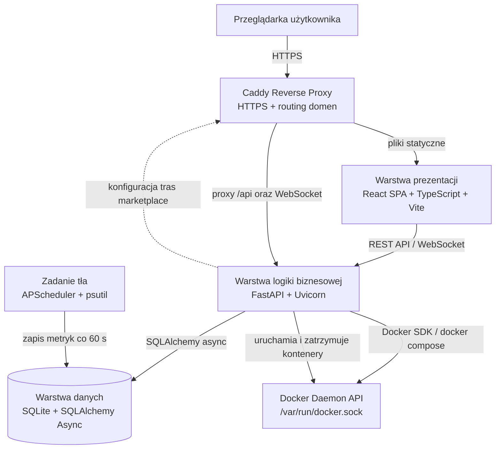

### 1. Warstwa Prezentacji (Frontend)
Zbudowana w oparciu o React, TypeScript oraz Vite. Aplikacja jest w pełni jednostronicowa (SPA). Komunikacja z API backendu odbywa się poprzez zapytania REST (z użyciem metody fetch opakowanej w hooki TanStack Query, co zapewnia cache'owanie i reaktywność). W przypadku terminala kontenerów, frontend nawiązuje połączenie za pomocą gniazd dwukierunkowych **WebSockets**, przekazując dane wejściowe z klawiatury użytkownika do biblioteki `xterm.js` i odbierając strumień wyjściowy z kontenera.

### 2. Warstwa Logiki Biznesowej (Backend)
FastAPI uruchomiony pod kontrolą serwera Uvicorn. Backend przetwarza żądania aplikacji, obsługuje uwierzytelnianie JWT dla modułu konta użytkownika (`GET /api/auth/me`, konfiguracja 2FA) oraz wystawia endpointy administracyjne dla modułów Docker, Backup, Marketplace i Domen. W aktualnej wersji kontrola dostępu do głównego panelu jest realizowana po stronie frontendu przez chroniony layout React, natomiast część endpointów administracyjnych backendu jest projektowana jako API wewnętrzne przeznaczone do pracy za Caddy, w sieci LAN lub za VPN. Wykorzystuje pakiet `apscheduler` działający w tle, który co 60 sekund pobiera metryki systemowe (używając biblioteki `psutil`), zapisuje je do bazy danych i usuwa rekordy starsze niż 7 dni. Dynamiczne operacje na kontenerach są przekazywane do API Dockera poprzez lokalne gniazdo UNIXowe `/var/run/docker.sock`.

### 3. Warstwa Danych
Lokalny plik bazy danych SQLite `homelab.db` zarządzany za pomocą SQLAlchemy ORM z wykorzystaniem asynchronicznego sterownika `aiosqlite`. Baza przechowuje użytkowników, ustawienia konfiguracyjne, historię metryk oraz rekordy aplikacji z Marketplace. Tabela `audit_log` jest przygotowana w modelu danych jako podstawa mechanizmu audytu, ale w obecnym stanie projektu nie wszystkie akcje modyfikujące zapisują jeszcze wpisy audytowe.

---

## 5) Wymagania

### a) Wymagania funkcjonalne

| Identyfikator | Opis Wymagania | Priorytet | Sposób Weryfikacji |
| :--- | :--- | :--- | :--- |
| **F1** | System musi wymusić rejestrację konta administratora przy pierwszym uruchomieniu. | Krytyczny | Przekierowanie na stronę Setup przy braku rekordów w tabeli `users`. |
| **F2** | System musi umożliwiać logowanie użytkowników za pomocą loginu, hasła i kodu 2FA TOTP. | Krytyczny | Walidacja hasła bcrypt oraz kodu pyotp. |
| **F3** | System musi zbierać i prezentować na wykresie metryki procesora, RAM, dysku i sieci w czasie rzeczywistym. | Wysoki | Odpytywanie endpointu `/api/metrics` przez klienta React. |
| **F4** | System musi wyświetlać kompletną listę kontenerów Docker wraz z ich aktualnym stanem. | Wysoki | Wywołanie Docker SDK i mapowanie struktur na JSON. |
| **F5** | Administrator musi mieć możliwość startu, zatrzymania, restartu i usunięcia każdego kontenera. | Wysoki | Wywołanie metod w `DockerService`. |
| **F6** | System musi pozwalać na bezpośrednią edycję pliku docker-compose.yml wybranego kontenera w przeglądarce. | Średni | Komponent CodeMirror we frontendzie, zapis pliku przez backend. |
| **F7** | System musi udostępniać interaktywną konsolę webową do wnętrza kontenera. | Średni | Nawiązanie połączenia WebSocket z endpointem `/api/containers/{id}/exec`. |
| **F8** | Administrator musi mieć możliwość zainstalowania aplikacji z Marketplace z predefiniowanego szablonu. | Wysoki | Zapisanie plików konfiguracyjnych i uruchomienie `docker compose up -d`. |
| **F9** | System musi umożliwiać konfigurację bazowej domeny podczas pierwszego uruchomienia oraz synchronizację tras Caddy dla dashboardu i aplikacji z Marketplace. | Średni | Zapis ustawień `setup_domain`, `setup_https_enabled` w tabeli `settings` oraz wywołanie synchronizacji tras Caddy. |
| **F10** | System musi umożliwiać tworzenie, pobieranie oraz przywracanie kopii zapasowych baz danych i konfiguracji aplikacji. | Wysoki | Pakowanie plików do archiwów tar.gz przez `BackupService`. |
| **F11** | System powinien posiadać strukturę bazy przygotowaną pod rejestr logów audytowych operacji administracyjnych. | Średni | Istnienie modelu i tabeli `audit_log`; pełne podłączenie zapisu zdarzeń do endpointów pozostaje zadaniem rozwojowym. |

### b) Wymagania niefunkcjonalne
* **NF1 (Bezpieczeństwo):** Hasła użytkowników muszą być zabezpieczone solonym hashem `bcrypt`. Tokeny sesyjne JWT muszą wygasać po 15 minutach (access token), a tokeny odświeżające (refresh token) po 7 dniach.
* **NF2 (Wydajność):** Czas odpowiedzi interfejsu API dla zapytań o status kontenerów i metryki nie może przekraczać 200 ms przy normalnym obciążeniu serwera.
* **NF3 (Przenośność):** Backend i frontend aplikacji muszą być łatwe do uruchomienia w środowisku skonteneryzowanym (Dockerfile) oraz na maszynie wirtualnej Ubuntu 22.04 LTS/24.04 LTS.
* **NF4 (Niezawodność):** Utrata zasilania lub awaria bazy danych SQLite nie może uszkodzić struktury bazy danych. Operacje zapisu muszą być transakcyjne (ACID).

---

## 6) Ograniczenia (sprzęt, oprogramowanie)
* **Wyłączna zgodność z systemem Ubuntu:** Aplikacja jest przeznaczona i przetestowana wyłącznie na serwerach z systemem operacyjnym **Ubuntu 22.04 LTS** lub **Ubuntu 24.04 LTS**. Działanie na innych dystrybucjach Linuxa (np. Debian, CentOS, Arch) nie jest oficjalnie wspierane i może wymagać ręcznej konfiguracji zależności. Systemy Windows i macOS nie są obsługiwane.
* **Zależność od Docker Engine:** Aplikacja działa poprawnie wyłącznie w środowiskach, w których zainstalowany jest Docker Daemon. Wymagana jest wersja Docker Engine 24.0 lub nowsza, dostępna domyślnie w repozytoriach Ubuntu.
* **Współbieżność SQLite:** SQLite obsługuje współbieżny odczyt i zapis w trybie WAL (Write-Ahead Logging). W celu uniknięcia błędów blokowania, backend korzysta z asynchronicznych sesji SQLAlchemy i puli połączeń skonfigurowanych w trybie pojedynczego zapisu, co jest w pełni wystarczające dla typowego użytkowania domowego.
* **Uprawnienia Root/Docker:** Proces backendu musi posiadać dostęp do `/var/run/docker.sock`. Najbezpieczniejszą praktyką jest uruchamianie procesu w kontenerze z zmapowanym gniazdem Docker lub jako użytkownik należący do grupy `docker`.

---

# Dokumentacja projektowa

## 7) Użytkownicy (aktorzy/role/persony)

### Role w systemie

Model użytkownika przewiduje pole `role`, dzięki czemu projekt może rozróżniać role administracyjne i odczytowe. W aktualnej implementacji produkcyjny przepływ tworzy pierwsze konto administratora (`admin`), natomiast pełne zarządzanie wieloma kontami oraz egzekwowanie roli `viewer` w endpointach administracyjnych nie jest jeszcze zaimplementowane.

| Rola | Opis | Uprawnienia |
|:-----|:-----|:------------|
| `admin` | Administrator serwera — właściciel homelabu | Rola tworzona przez kreator pierwszego konta; pełen dostęp w interfejsie aplikacji |
| `viewer` | Obserwator — osoba z ograniczonym dostępem | Rola przewidziana w modelu danych jako kierunek rozwoju; brak gotowego formularza tworzenia i brak pełnej egzekucji uprawnień w API |

### Persony Użytkowników

#### Persona 1: Administrator homelabu (Rola: `admin`)
* **Opis:** Właściciel i główny użytkownik serwera domowego (np. miniPC, Raspberry Pi lub stary komputer PC działający całą dobę). Samodzielnie instaluje i utrzymuje usługi self-hosted, takie jak AdGuard Home, Nextcloud czy serwer Plex. Preferuje zarządzanie serwerem przez przeglądarkę zamiast przez terminal SSH.
* **Scenariusze użycia:** Uruchamianie i zatrzymywanie kontenerów, wdrażanie nowych aplikacji z Marketplace, tworzenie kopii zapasowych przed aktualizacją, konfiguracja domeny i certyfikatu SSL, diagnostyka przez terminal kontenera.
* **Profil bezpieczeństwa:** Loguje się hasłem, a po włączeniu 2FA także kodem TOTP. Posiada pełne uprawnienia do obsługi panelu. Token JWT wygasa po 15 minutach.

#### Persona 2: Użytkownik domowy (Rola: `viewer`)
* **Opis:** Domownik lub współpracownik, który korzysta z usług uruchomionych na serwerze (np. Home Assistant, serwer multimediów Plex). Potrzebuje wglądu w stan serwera — czy usługi działają i czy serwer nie jest przeciążony — ale nie zarządza jego konfiguracją.
* **Scenariusze użycia:** Sprawdzenie na Dashboardzie, czy serwer nie jest przeciążony (CPU/RAM); weryfikacja, że kontener z daną usługą ma status „Running"; odczyt wykresów historycznych w celu znalezienia przyczyny spowolnienia.
* **Profil bezpieczeństwa:** Rola docelowo powinna mieć dostęp tylko do odczytu i brak możliwości zatrzymywania kontenerów, edycji konfiguracji lub wejścia do terminala. W obecnym stanie projektu jest to opis planowanego rozszerzenia, ponieważ backend nie stosuje jeszcze zależności `require_admin_user` na endpointach administracyjnych.

---

## 8) Przypadki użycia

### a) Diagramy
Diagram przypadków użycia przedstawia relacje między aktorami a funkcjonalnościami systemu w postaci standardowej notacji UML:

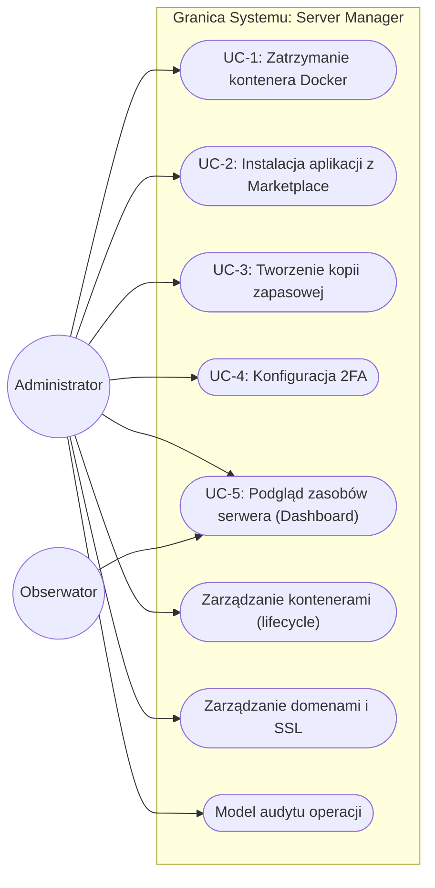

### b) Scenariusze

#### Tabela Scenariusza UC-1: Zatrzymanie kontenera Docker

| Element scenariusza | Opis szczegółowy |
| :--- | :--- |
| **Aktor główny** | Administrator |
| **Cel** | Bezpieczne zatrzymanie wybranej usługi uruchomionej w kontenerze Docker |
| **Warunki wstępne** | Zalogowanie na konto z rolą `admin`, przejście do widoku listy kontenerów, kontener posiada status „Running" |
| **Krok 1** | Administrator klika przycisk „Stop" obok nazwy kontenera. |
| **Krok 2** | Aplikacja kliencka React wysyła zapytanie `POST /api/containers/{container_id}/stop`. |
| **Krok 3** | Frontend dopuszcza do widoku tylko zalogowanego użytkownika. Backend pobiera instancję `DockerService` i wywołuje metodę `stop()`. |
| **Krok 4** | Backend wysyła żądanie do demona Docker przez gniazdo unixowe `/var/run/docker.sock`. |
| **Krok 5** | Demon Docker wysyła sygnał SIGTERM do procesu głównego w kontenerze, a po upływie 10s SIGKILL. |
| **Krok 6** | Kontener zostaje zatrzymany. Obecna implementacja zwraca status operacji bez zapisu wpisu do `audit_log`; tabela audytu jest przygotowana jako mechanizm rozwojowy. |
| **Krok 7** | Backend zwraca HTTP 200, frontend odświeża interfejs wyświetlając status kontenera jako „Stopped". |
| **Przebieg alternatywny** | W kroku 5 kontener nie odpowiada. Backend zwraca HTTP 400 z opisem błędu, a użytkownik otrzymuje powiadomienie w interfejsie. |

---

#### Tabela Scenariusza UC-2: Instalacja aplikacji z Marketplace

| Element scenariusza | Opis szczegółowy |
| :--- | :--- |
| **Aktor główny** | Administrator |
| **Cel** | Wdrożenie nowej aplikacji self-hosted (np. AdGuard Home) z katalogu Marketplace |
| **Warunki wstępne** | Zalogowanie na konto z rolą `admin`, Docker Engine zainstalowany i uruchomiony na hoście |
| **Krok 1** | Administrator przechodzi do zakładki Marketplace i wybiera aplikację (np. `adguard-home`). |
| **Krok 2** | Przed wdrożeniem frontend wysyła `POST /api/marketplace/preflight` z wybranym `template_id`, `app_name` i `host_port`. |
| **Krok 3** | Backend waliduje dane: sprawdza, czy aplikacja o tej nazwie już istnieje w tabeli `apps` oraz czy wybrany port nie jest zajęty. Zwraca wynik weryfikacji wstępnej. |
| **Krok 4** | Jeśli walidacja przeszła pomyślnie, frontend wysyła `POST /api/marketplace/deploy` z pełnymi parametrami. |
| **Krok 5** | `MarketplaceService` tworzy katalog aplikacji na dysku hosta, zapisuje wygenerowany plik `docker-compose.yml` i plik `.env` z parametrami. |
| **Krok 6** | Serwis uruchamia `docker compose up -d`, co pobiera obraz Docker i startuje kontener. |
| **Krok 7** | Backend dodaje rekord do tabeli `apps` (status: `deployed`) i synchronizuje trasy Caddy (`sync_caddy_marketplace_routes`). |
| **Krok 8** | Frontend wyświetla komunikat sukcesu z adresem URL aplikacji (np. `http://serwer:3000`). |
| **Przebieg alternatywny (konflikt portu)** | W kroku 3 wybrany port jest zajęty. Backend zwraca HTTP 400 z opisem konfliktu. Frontend wyświetla błąd walidacji i blokuje kontynuację. |
| **Przebieg alternatywny (duplikat nazwy)** | W kroku 4 aplikacja o tej nazwie już istnieje. Backend zwraca HTTP 400 `„Application with this name already exists"`. |

---

#### Tabela Scenariusza UC-3: Tworzenie kopii zapasowej konfiguracji

| Element scenariusza | Opis szczegółowy |
| :--- | :--- |
| **Aktor główny** | Administrator |
| **Cel** | Pobranie archiwum z konfiguracją serwera przed planowaną aktualizacją systemu |
| **Warunki wstępne** | Zalogowanie na konto z rolą `admin`, przejście do zakładki Backup |
| **Krok 1** | Administrator klika przycisk „Eksportuj kopię zapasową" i wybiera tryb `config` (tylko konfiguracja, bez wolumenów danych). |
| **Krok 2** | Frontend wysyła `POST /api/backup/export?mode=config`. |
| **Krok 3** | Backend tworzy instancję `BackupService` i wywołuje metodę `create_backup(include_volumes=False)`. |
| **Krok 4** | `BackupService` pakuje do archiwum `tar.gz` plik bazy danych `homelab.db` oraz pliki konfiguracyjne aplikacji (`docker-compose.yml`, `.env`) ze wszystkich katalogów Marketplace. |
| **Krok 5** | Backend zwraca archiwum jako `FileResponse` z nagłówkiem `Content-Type: application/gzip`. |
| **Krok 6** | Przeglądarka automatycznie pobiera plik na dysk lokalny administratora (np. `backup-2026-06-20.tar.gz`). |
| **Przebieg alternatywny** | Błąd zapisu dysku w kroku 4. Backend zwraca HTTP 500 z komunikatem `„Failed to create backup"`. |

---

#### Tabela Scenariusza UC-4: Konfiguracja uwierzytelniania dwuetapowego (2FA)

| Element scenariusza | Opis szczegółowy |
| :--- | :--- |
| **Aktor główny** | Administrator |
| **Cel** | Włączenie weryfikacji dwuetapowej TOTP dla swojego konta w celu zwiększenia bezpieczeństwa |
| **Warunki wstępne** | Zalogowanie na konto administratora, 2FA aktualnie wyłączone (`totp_secret` = NULL w bazie) |
| **Krok 1** | Administrator przechodzi do Ustawień konta i klika „Włącz 2FA". |
| **Krok 2** | Frontend wysyła `POST /api/auth/2fa/setup`. |
| **Krok 3** | Backend generuje nowy losowy klucz TOTP (base32) przez `create_pending_totp()` i zapisuje go tymczasowo w bazie danych. Zwraca sekret oraz `otpauth://` URI. |
| **Krok 4** | Frontend renderuje kod QR na podstawie zwróconego URI. Administrator skanuje go aplikacją uwierzytelniającą (np. Google Authenticator, Aegis). |
| **Krok 5** | Administrator wpisuje 6-cyfrowy kod TOTP wygenerowany przez aplikację i klika „Zweryfikuj". |
| **Krok 6** | Frontend wysyła `POST /api/auth/2fa/verify` z `{ "code": "123456" }`. |
| **Krok 7** | Backend waliduje kod przez `verify_or_enable_two_factor()`. Jeśli kod jest poprawny i istnieje tymczasowy sekret, backend trwale aktywuje 2FA (`outcome = "enabled"`). |
| **Krok 8** | Backend wystawia nową parę tokenów JWT (access + refresh) i zwraca `status: "enabled"` z danymi sesji. Od tego momentu każde kolejne logowanie wymaga kodu TOTP. |
| **Przebieg alternatywny** | W kroku 7 kod jest niepoprawny lub wygasł (okno 30s). Backend zwraca HTTP 400. Administrator proszony jest o ponowne wpisanie aktualnego kodu. |

---

#### Tabela Scenariusza UC-5: Podgląd zasobów serwera przez Obserwatora

| Element scenariusza | Opis szczegółowy |
| :--- | :--- |
| **Aktor główny** | Obserwator (rola: `viewer`) |
| **Cel** | Sprawdzenie, czy serwer jest przeciążony — w odpowiedzi na zgłoszony problem z dostępnością usługi |
| **Warunki wstępne** | Zalogowanie na konto z rolą `viewer`, usługa home Assistant zgłasza problemy z wydajnością |
| **Krok 1** | Obserwator loguje się do panelu (bez 2FA, jeśli nie skonfigurowano dla konta viewer). |
| **Krok 2** | System przekierowuje na Dashboard z wykresami zasobów serwera. |
| **Krok 3** | Obserwator odczytuje aktualne wartości kart: CPU 94%, RAM 87%, dysk 70%. |
| **Krok 4** | Na wykresach historycznych zauważa, że wysokie obciążenie CPU trwa od ok. 2 godzin. |
| **Krok 5** | Przechodzi do widoku listy kontenerów i sprawdza, że kontener `home-assistant` ma status „Running", lecz inne kontenery (`plex`) zostały automatycznie wyłączone z powodu braku zasobów. |
| **Krok 6** | Obserwator informuje administratora o sytuacji. Administrator loguje się i restartuje lub zatrzymuje przeciążone usługi. |
| **Ograniczenia roli** | To scenariusz docelowy dla roli `viewer`. Aktualna implementacja posiada pole `role` w modelu użytkownika, ale nie posiada jeszcze pełnego mechanizmu ukrywania akcji i zwracania `HTTP 403 Forbidden` dla endpointów administracyjnych. |


---

## 9) Baza danych (diagram struktury danych)

### a) Model koncepcyjny

Model koncepcyjny przedstawia byty (encje) biznesowe systemu oraz relacje między nimi na najwyższym poziomie abstrakcji — bez uwzględnienia typów danych czy kluczy. Celem jest uchwycenie *co* system przechowuje i *jakie zależności* istnieją między elementami dziedziny.

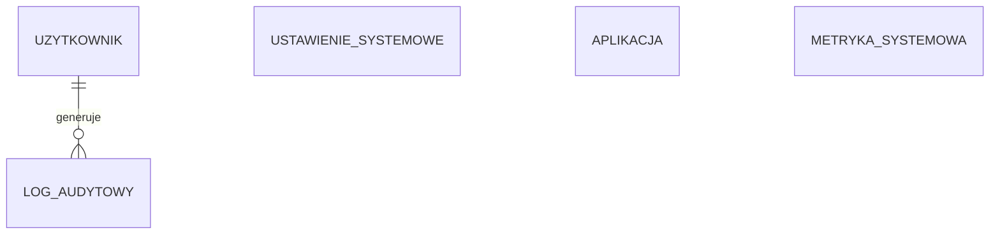

**Opis encji koncepcyjnych:**
* **Użytkownik** — osoba posiadająca konto w systemie, uprawniona do logowania i wykonywania operacji. Docelowo jego działania mogą być powiązane z wpisami w dzienniku audytowym.
* **Aplikacja** — usługa zainstalowana z wbudowanego sklepu Marketplace, uruchomiona jako kontener Docker na serwerze hosta.
* **Metryka systemowa** — cyklicznie pobierana próbka obciążenia serwera (CPU, RAM, dysk, sieć), zapisywana w celu wizualizacji trendów historycznych.
* **Ustawienie systemowe** — parametr konfiguracyjny systemu przechowywany jako para klucz-wartość (np. lista domen, progi alertów).
* **Log audytowy** — struktura danych przygotowana do rejestrowania operacji administracyjnych wykonanych przez użytkownika lub proces systemowy.

---

### b) Model logiczny

Model logiczny rozszerza model koncepcyjny o nazwy atrybutów, klucze główne (PK) i obce (FK) oraz typy ogólne (niezależne od konkretnego systemu RDBMS). Stanowi pośredni etap między wizją biznesową a implementacją fizyczną.

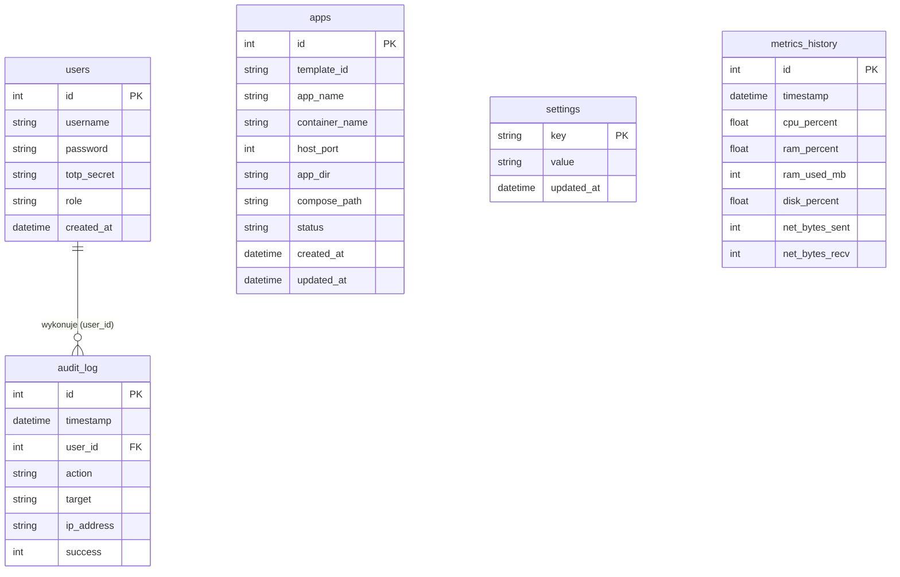

**Kluczowe decyzje modelu logicznego:**
* Tabela `settings` wykorzystuje klucz naturalny (`key`) zamiast sztucznego identyfikatora numerycznego, ponieważ klucze ustawień są unikalne i semantycznie znaczące.
* Tabela `audit_log` posiada nullable klucz obcy `user_id` do tabeli `users`. W obecnej migracji nie zdefiniowano reguły `ON DELETE SET NULL`, dlatego ewentualne usuwanie użytkowników wymagałoby osobnej obsługi po stronie aplikacji lub migracji bazy.
* Tabele `apps` i `metrics_history` nie posiadają relacji klucza obcego do innych tabel — są encjami niezależnymi, ponieważ kontenery Docker są zarządzane przez zewnętrzny demon Docker, a metryki są zbierane automatycznie przez proces systemowy.

---

### c) Model fizyczny — Opis Tabel Bazodanowych

System posiada 5 tabel w bazie SQLite:

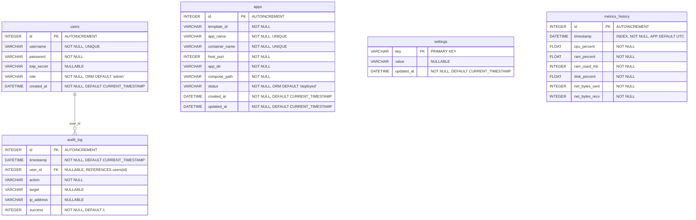

#### 1. Tabela `users` (Użytkownicy)
Przechowuje dane kont użytkowników systemu.
* `id` (INTEGER, PK, Autoincrement): Unikalny identyfikator użytkownika.
* `username` (VARCHAR, Not Null, Unique): Nazwa użytkownika (login).
* `password` (VARCHAR, Not Null): Hash hasła wygenerowany algorytmem `bcrypt`.
* `totp_secret` (VARCHAR, Nullable): Klucz współdzielony base32 dla uwierzytelniania dwuetapowego (2FA). Jeśli pole jest puste, 2FA jest wyłączone dla tego konta.
* `role` (VARCHAR, Not Null, ORM Default 'admin'): Rola użytkownika (`admin` lub `viewer`).
* `created_at` (DATETIME, Not Null, Default Now): Data utworzenia konta.

#### 2. Tabela `apps` (Aplikacje z Marketplace)
Rejestruje aplikacje wdrożone z wbudowanego sklepu.
* `id` (INTEGER, PK, Autoincrement): Unikalny identyfikator instalacji.
* `template_id` (VARCHAR, Not Null): Identyfikator szablonu aplikacji (np. `adguard-home`).
* `app_name` (VARCHAR, Unique, Not Null): Przyjazna nazwa usługi nadana przez użytkownika.
* `container_name` (VARCHAR, Unique, Not Null): Nazwa głównego kontenera w Dockerze.
* `host_port` (INTEGER, Not Null): Port hosta, na którym wystawiono usługę.
* `app_dir` (VARCHAR, Not Null): Ścieżka na dysku hosta, w której przechowywane są wolumeny danych aplikacji.
* `compose_path` (VARCHAR, Not Null): Ścieżka do zapisanego pliku `docker-compose.yml` na serwerze.
* `status` (VARCHAR, Not Null, ORM Default 'deployed'): Status rekordu instalacji aplikacji. W obecnej implementacji trwały rekord otrzymuje zwykle wartość `deployed`, a bieżący stan działania jest pobierany z demona Docker (`running`, `exited`, `not-found` itd.).
* `created_at` (DATETIME, Not Null, Default Now): Data wdrożenia aplikacji.
* `updated_at` (DATETIME, Not Null, Default Now): Data ostatniej aktualizacji rekordu.


#### 3. Tabela `settings` (Ustawienia systemowe)
Uniwersalny słownik klucz-wartość na parametry konfiguracyjne.
* `key` (VARCHAR, PK): Unikalny klucz ustawienia (np. `setup_domain`, `setup_acme_email`, `setup_https_enabled`, `alert_cpu_threshold`).
* `value` (VARCHAR, Nullable): Wartość ustawienia zapisana jako tekst (np. dane JSON konfiguracji).
* `updated_at` (DATETIME, Not Null, Default Now): Data ostatniej aktualizacji parametru.

#### 4. Tabela `metrics_history` (Metryki historyczne)
Przechowuje próbki obciążenia serwera.
* `id` (INTEGER, PK, Autoincrement): Unikalny identyfikator próbki.
* `timestamp` (DATETIME, Index, Not Null, App Default UTC): Czas wykonania pomiaru ustawiany przez aplikację podczas zapisu próbki.
* `cpu_percent` (FLOAT, Not Null): Średnie obciążenie procesora ze wszystkich rdzeni.
* `ram_percent` (FLOAT, Not Null): Zużycie pamięci RAM w procentach.
* `ram_used_mb` (INTEGER, Not Null): Zużycie pamięci RAM w megabajtach.
* `disk_percent` (FLOAT, Not Null): Zużycie głównego dysku twardego w procentach.
* `net_bytes_sent` (INTEGER, Not Null): Liczba bajtów wysłanych przez interfejsy sieciowe.
* `net_bytes_recv` (INTEGER, Not Null): Liczba bajtów odebranych przez interfejsy sieciowe.

#### 5. Tabela `audit_log` (Przygotowana tabela rejestru zdarzeń bezpieczeństwa)
Struktura przewidziana do rejestrowania działań administracyjnych w systemie.
* `id` (INTEGER, PK, Autoincrement): Identyfikator logu.
* `timestamp` (DATETIME, Not Null, Default Now): Czas wystąpienia zdarzenia.
* `user_id` (INTEGER, FK, Nullable): Powiązanie z tabelą `users.id` (puste dla zdarzeń systemowych).
* `action` (VARCHAR, Not Null): Nazwa wykonanej akcji (np. `container.stop`, `backup.restore`, `auth.login`).
* `target` (VARCHAR, Nullable): Nazwa obiektu poddanego akcji (np. nazwa kontenera `plex`).
* `ip_address` (VARCHAR, Nullable): Adres IP klienta wykonującego żądanie.
* `success` (INTEGER, Not Null, Default 1): Flaga powodzenia operacji (1 = Sukces, 0 = Porażka).

---

## 10) Diagramy sekwencji

### Lista wszystkich diagramów sekwencji w systemie:
1. **Proces autoryzacji z uwzględnieniem weryfikacji kodem TOTP (2FA) podczas logowania** — *zamieszczony poniżej*.
2. **Proces zarządzania cyklem życia kontenera (Start/Stop/Restart/Delete)** — przepływ żądania od przeglądarki użytkownika, przez API FastAPI (DockerService), do demona Docker i gniazda unixowego.
3. **Proces instalacji i konfiguracji nowej aplikacji z Marketplace** — pobranie szablonu, alokacja wolnego portu, zapis plików Compose na dysku, wywołanie komendy Docker i rejestracja aplikacji w bazie.
4. **Proces tworzenia i przywracania kopii zapasowej** — wywołanie `BackupService`, pakowanie plików i bazy danych do archiwum `.tar.gz`, a przy imporcie walidacja archiwum, odtworzenie plików i ponowne uruchomienie aplikacji Marketplace z kopii.
5. **Proces pobierania i zapisywania metryk systemowych w tle** — cykliczne uruchamianie zadania (APScheduler), odczyt przez bibliotekę `psutil` i zapis parametrów serwera do SQLite.
6. **Proces dynamicznej konfiguracji tras odwrotnego proxy Caddy** — automatyczne generowanie wpisów dla nowych subdomen i portów kontenerów oraz wywołanie przeładowania konfiguracji Caddy.

### Zamieszczony diagram sekwencji:
Poniższy diagram przedstawia kluczowy proces logowania z dwuskładnikowym uwierzytelnieniem (2FA):

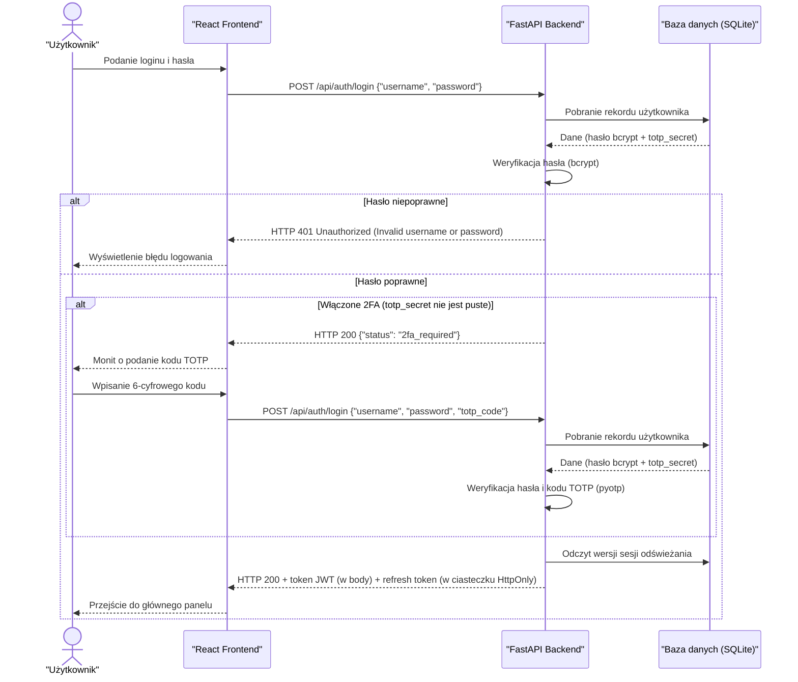

---

## 11) Diagramy aktywności

### Lista wszystkich diagramów aktywności w systemie:
1. **Przepływ działań systemu podczas instalacji nowej aplikacji z wbudowanego Marketplace** — *zamieszczony poniżej*.
2. **Proces przywracania danych z kopii zapasowej (Restore)** — upload pliku `.tar.gz`, bezpieczna ekstrakcja archiwum, walidacja manifestu i sum kontrolnych, odtworzenie bazy SQLite, plików konfiguracyjnych i opcjonalnie wolumenów Docker.
3. **Konfiguracja dwuetapowego uwierzytelniania (2FA)** — wygenerowanie losowego klucza TOTP, wyświetlenie kodu QR, oczekiwanie na kod potwierdzający od użytkownika, weryfikacja przez pyotp i zapis w bazie danych.
4. **Obsługa sesji interaktywnej konsoli kontenera** — otwarcie połączenia WebSocket, uruchomienie procesu shell `/bin/sh` w kontenerze i nawiązanie dwukierunkowej transmisji danych.

### Zamieszczony diagram aktywności:
Poniższy diagram przedstawia przepływ instalacji nowej aplikacji z Marketplace:

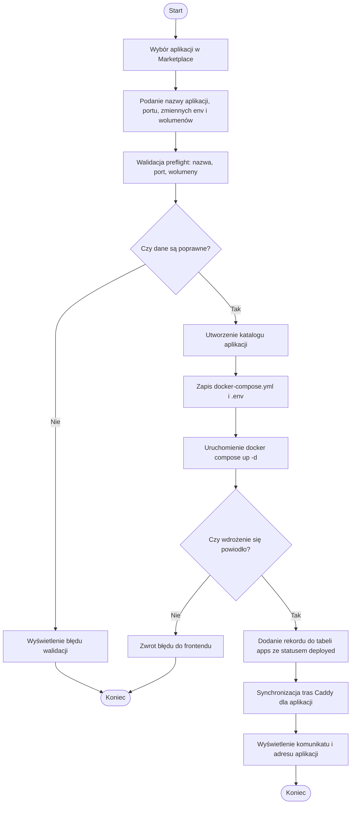

---

## 12) Diagramy stanów

### Lista wszystkich diagramów stanów w systemie:
1. **Cykl życia kontenera Docker zarządzanego przez system** — *zamieszczony poniżej*.
2. **Cykl życia operacji wdrożenia aplikacji z Marketplace** — stany operacji w interfejsie/API: `Idle` (brak aktywnej instalacji), `Validating` (preflight), `Deploying` (zapis plików i uruchomienie Docker Compose), `Deployed` (rekord `apps` zapisany po sukcesie), `Failed` (błąd walidacji lub wdrożenia) oraz `Removing` (usuwanie aplikacji). W bazie danych trwały rekord powstaje dopiero po udanym wdrożeniu.
3. **Stany procesu tworzenia i odtwarzania kopii zapasowej** — stan operacji backupu/restore: `Idle`, `In Progress` (wykonywanie), `Success` (zakończono pomyślnie), `Failure` (błąd, np. niepoprawne archiwum lub brak miejsca na dysku).
4. **Stan uwierzytelnienia sesji i tokenów JWT** — cykl życia sesji: `Guest` (niezalogowany), `Password Verified` (hasło poprawne, oczekiwanie na TOTP), `Session Active` (wygenerowany token JWT), `Session Expired` (token wygasł, konieczność odświeżenia).

### Zamieszczony diagram stanów:
Poniższy diagram przedstawia cykl życia kontenera Docker obsługiwany lub obserwowany przez panel:

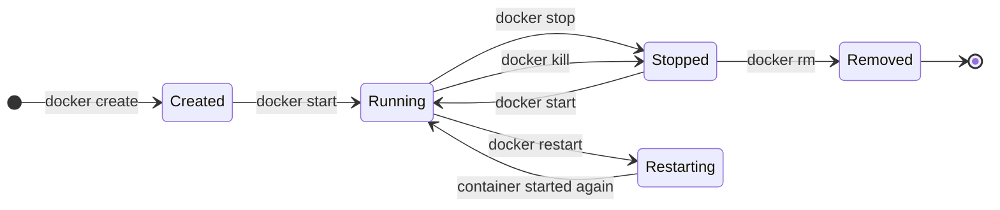

---

## 13) Dokumentacja bezpieczeństwa

### Opis wdrożonych mechanizmów zapewnienia bezpieczeństwa:

* **1. Uwierzytelnianie i autoryzacja sesji (JWT):**
  * Dostęp do informacji o bieżącym profilu użytkownika (`/api/auth/me`) oraz konfiguracja 2FA wymagają weryfikacji tokenu JWT przez zależność `require_current_user`. Token dostępu (access token) jest przekazywany w nagłówku `Authorization: Bearer <token>`, a token odświeżania (refresh token) przechowywany jest w ciasteczku `HttpOnly` z flagą `SameSite=Lax` oraz flagą `Secure` dla połączeń HTTPS.
  * Aplikacja React chroni główne widoki panelu przez `ProtectedLayout` i przekierowuje niezalogowanych użytkowników na stronę logowania. W obecnej wersji endpointy administracyjne modułów Docker, Backup, Marketplace, Domeny i Alerty nie wymagają jeszcze tokenu po stronie backendu; są traktowane jako API wewnętrzne uruchamiane za reverse proxy i w zaufanej sieci.
* **2. Bezpieczeństwo warstwy sieciowej (Homelab Design):**
  * Endpointy funkcyjne (zarządzanie kontenerami, kopiami zapasowymi, domenami oraz szablonami) są zaprojektowane jako wewnętrzne interfejsy API, przeznaczone do pracy w wydzielonej, bezpiecznej sieci lokalnej (LAN/VLAN) lub za tunelem VPN. Ograniczenie dostępu do nich z zewnątrz realizowane jest na poziomie sieciowym oraz poprzez konfigurację serwera proxy Caddy, a nie w samej logice aplikacyjnej (co upraszcza architekturę i narzut sieciowy w warunkach domowych).
* **3. Haszowanie haseł (Secure by Design):**
  * Hasła użytkowników są haszowane przy użyciu algorytmu `bcrypt` z losową solą. W bazie danych nigdy nie są zapisywane hasła w postaci otwartej.
* **4. Uwierzytelnianie dwuetapowe (2FA TOTP):**
  * Zastosowano algorytm generowania jednorazowych haseł czasowych TOTP (zgodny z RFC 6238) za pomocą biblioteki `pyotp`. Klucze współdzielone (sekrety) są zapisywane w bazie danych po uprzedniej pomyślnej weryfikacji kodu testowego. Przy włączonym 2FA logowanie wymaga podania aktualnego 6-cyfrowego kodu.
* **5. Dzienniki audytowe (Audit Trail):**
  * Projekt zawiera model i tabelę `audit_log`, które definiują strukturę przyszłego dziennika audytowego: czas zdarzenia, identyfikator użytkownika, akcję, cel, adres IP oraz flagę powodzenia. W aktualnym stanie kodu zapis do tej tabeli nie jest jeszcze podłączony do operacji logowania, kontenerów, backupu ani marketplace, dlatego audyt należy traktować jako przygotowany element modelu danych i zadanie rozwojowe.

---

## 14) Zwiększanie dostępności (WCAG)
Aplikacja została zaprojektowana z uwzględnieniem podstawowych zasad dostępności interfejsu webowego. Weryfikację automatyczną wykonano narzędziem **Google Lighthouse** dla widoku dashboardu dostępnego pod adresem `https://scovy.vip/dashboard`. Raport z testu znajduje się w pliku [Lighthouse.pdf](Lighthouse.pdf).

Wyniki Lighthouse z dnia **20.06.2026, 22:01**:
* **Performance:** 100/100
* **Accessibility:** 94/100
* **Best Practices:** 96/100
* **SEO:** 82/100

Zastosowane rozwiązania zwiększające dostępność:
* **Dostępność z klawiatury:** Nawigacja główna, formularze i przyciski są zbudowane z natywnych elementów HTML (`button`, `input`, `a`), dzięki czemu mogą być obsługiwane klawiaturą. Widoczne stany focus ułatwiają orientację użytkownikowi poruszającemu się bez myszy.
* **Etykiety i semantyka:** Formularze logowania, zakładania konta i konfiguracji 2FA wykorzystują etykiety `label`, a elementy statusu/błędów używają ról takich jak `alert` lub `status`. Nawigacja boczna posiada opis `aria-label`.
* **Czytelność interfejsu:** Aplikacja używa spójnych nagłówków, kart metryk, tabel i komunikatów błędów. Komponenty są projektowane tak, aby najważniejsze informacje były widoczne bez konieczności korzystania z terminala.
* **Kontrast i hierarchia nagłówków:** Raport Lighthouse wskazał dwa obszary do dalszej poprawy: niewystarczający kontrast części par kolorów oraz kolejność niektórych nagłówków. Oznacza to, że aplikacja osiąga wysoki wynik dostępności, ale nie należy deklarować pełnej zgodności z WCAG AA bez dodatkowego audytu manualnego.

---

# Dokumentacja deweloperska

## 15) Diagram klas
Struktura serwisów logiki biznesowej backendu FastAPI:

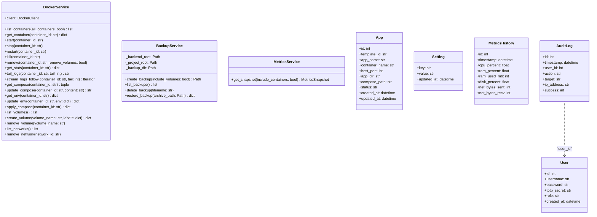

---

## 16) Kod SQL

### a) Standard SQL do tworzenia modelu bazy
Poniższy kod DDL tworzy strukturę tabel w bazie danych (w tym tabelę ustawień `settings`):

```sql
-- Tabela użytkowników panelu
CREATE TABLE users (
    id INTEGER PRIMARY KEY AUTOINCREMENT,
    username VARCHAR NOT NULL UNIQUE,
    password VARCHAR NOT NULL,
    totp_secret VARCHAR,
    role VARCHAR NOT NULL,
    created_at DATETIME DEFAULT CURRENT_TIMESTAMP NOT NULL
);

-- Tabela zainstalowanych aplikacji z Marketplace
CREATE TABLE apps (
    id INTEGER PRIMARY KEY AUTOINCREMENT,
    template_id VARCHAR NOT NULL,
    app_name VARCHAR NOT NULL UNIQUE,
    container_name VARCHAR NOT NULL UNIQUE,
    host_port INTEGER NOT NULL,
    app_dir VARCHAR NOT NULL,
    compose_path VARCHAR NOT NULL,
    status VARCHAR NOT NULL,
    created_at DATETIME DEFAULT CURRENT_TIMESTAMP NOT NULL,
    updated_at DATETIME DEFAULT CURRENT_TIMESTAMP NOT NULL
);

-- Tabela ustawień systemowych (słownik klucz-wartość)
CREATE TABLE settings (
    key VARCHAR NOT NULL,
    value VARCHAR,
    updated_at DATETIME DEFAULT CURRENT_TIMESTAMP NOT NULL,
    PRIMARY KEY (key)
);

-- Tabela logów audytowych bezpieczeństwa
CREATE TABLE audit_log (
    id INTEGER PRIMARY KEY AUTOINCREMENT,
    timestamp DATETIME DEFAULT CURRENT_TIMESTAMP NOT NULL,
    user_id INTEGER,
    action VARCHAR NOT NULL,
    target VARCHAR,
    ip_address VARCHAR,
    success INTEGER DEFAULT 1 NOT NULL,
    FOREIGN KEY(user_id) REFERENCES users(id)
);
```

### b) Dialekt SQL
Zastosowano dialekt **SQLite 3**.
* Specyfika: Autoincrementacja klucza głównego realizowana za pomocą słów kluczowych `INTEGER PRIMARY KEY AUTOINCREMENT`. Wykorzystanie wbudowanych funkcji daty i czasu `CURRENT_TIMESTAMP` jako wartości domyślnych pól czasu. 
* W celu wsparcia historii metryk zoptymalizowano bazę pod kątem częstych zapisów poprzez indeksowanie timestampów:
```sql
CREATE TABLE metrics_history (
    id INTEGER PRIMARY KEY AUTOINCREMENT,
    timestamp DATETIME NOT NULL,
    cpu_percent FLOAT NOT NULL,
    ram_percent FLOAT NOT NULL,
    ram_used_mb INTEGER NOT NULL,
    disk_percent FLOAT NOT NULL,
    net_bytes_sent INTEGER NOT NULL,
    net_bytes_recv INTEGER NOT NULL
);
CREATE INDEX idx_metrics_history_ts ON metrics_history(timestamp);
```

Wartości domyślne `role = 'admin'`, `apps.status = 'deployed'` oraz czas próbki `metrics_history.timestamp` są ustawiane przez warstwę ORM/aplikacji. W migracjach Alembic nie wszystkie z nich są zdefiniowane jako `server_default`, dlatego w DDL powyżej pokazano faktyczne ograniczenia tabel i osobno opisano domyślne wartości aplikacyjne.

---

## 17) Przypadki testowe

### TC-1: Logowanie z uwzględnieniem blokady niepoprawnego hasła
* **Opis:** Weryfikacja reakcji systemu na podanie złego hasła logowania.
* **Kroki:**
  1. Wejdź na stronę główną logowania panelu.
  2. Wpisz istniejącą nazwę użytkownika (np. `admin`) oraz niepoprawne hasło.
  3. Kliknij przycisk `Sign in`.
* **Oczekiwany rezultat:** System nie loguje użytkownika. Zostaje wyświetlona informacja o nieprawidłowych danych uwierzytelniających, a backend zwraca odpowiedź `HTTP 401 Unauthorized`.

### TC-2: Instalacja z Marketplace na zajętym porcie
* **Opis:** Próba instalacji aplikacji z Marketplace w sytuacji, gdy jej port docelowy jest już przypisany do innej usługi na serwerze.
* **Kroki:**
  1. Uruchom dowolną usługę na porcie `8080`.
  2. W panelu przejdź do Marketplace.
  3. Spróbuj zainstalować aplikację mającą domyślny port zewnętrzny ustawiony na `8080`.
* **Oczekiwany rezultat:** System blokuje instalację na wczesnym etapie walidacji portów, wyświetla powiadomienie o konflikcie portów na hoście. Stan kontenerów Dockera pozostaje niezmieniony.

---

## 18) Testy jednostkowe
Testy projektu są podzielone na dwa zestawy, zgodnie z technologiami użytymi w aplikacji:
* **Backend:** testy Python uruchamiane poleceniem `pytest`.
* **Frontend:** testy React/TypeScript uruchamiane poleceniem `npm run test`, które wywołuje `vitest run`.

Poniżej przedstawiono przykładowe zaimplementowane kody testów, które faktycznie wchodzą w skład zestawu testów projektu:

### Test weryfikacji logowania z uwzględnieniem TOTP 2FA (z pliku [test_auth.py](../backend/tests/test_auth.py)):
```python
@pytest.mark.asyncio
async def test_login_requires_totp_when_enabled(client: AsyncClient, async_db: AsyncSession):
    secret = pyotp.random_base32()
    async_db.add(
        User(
            username="alice",
            password=hash_password("pass1234"),
            totp_secret=secret,
            role="admin",
        )
    )
    await async_db.flush()

    # Logowanie bez podania kodu TOTP powinno zwrócić status wyzwania (2fa_required)
    challenge_res = await client.post(
        "/api/auth/login",
        json={"username": "alice", "password": "pass1234"},
    )
    assert challenge_res.status_code == 200
    assert challenge_res.json()["status"] == "2fa_required"

    # Logowanie z nieprawidłowym kodem TOTP powinno zwrócić błąd 401
    invalid_res = await client.post(
        "/api/auth/login",
        json={"username": "alice", "password": "pass1234", "totp_code": "000000"},
    )
    assert invalid_res.status_code == 401

    # Logowanie z poprawnym kodem TOTP powinno zakończyć się sukcesem
    valid_res = await client.post(
        "/api/auth/login",
        json={
            "username": "alice",
            "password": "pass1234",
            "totp_code": pyotp.TOTP(secret).now(),
        },
    )
    assert valid_res.status_code == 200
    assert valid_res.json()["status"] == "ok"
```

### Test uruchamiania kontenerów Docker (z pliku [test_containers.py](../backend/tests/test_containers.py)):
```python
@pytest.mark.asyncio
async def test_start_container_success(client: AsyncClient):
    with patch("app.routers.containers.DockerService") as mock_service_cls:
        service = mock_service_cls.return_value
        service.start.return_value = None

        res = await client.post("/api/containers/abc123/start")

    assert res.status_code == 200
    assert res.json()["status"] == "ok"
```

Uruchomienie testów backendu w konsoli zwraca pełny sukces (72 testy zaliczone):
```bash
$ ./venv/bin/pytest
===================================== test session starts ======================================
platform linux -- Python 3.12.3, pytest-8.3.5, pluggy-1.6.0
rootdir: /home/scovy/server-manager/backend
configfile: pyproject.toml
testpaths: tests
plugins: cov-6.1.1, anyio-4.12.1, asyncio-0.25.3
asyncio: mode=Mode.AUTO, asyncio_default_fixture_loop_scope=function
collected 72 items

tests/test_auth.py .....                                                                 [  6%]
tests/test_backup.py ......                                                              [ 15%]
tests/test_backup_service.py ......                                                      [ 23%]
tests/test_containers.py ...........                                                     [ 38%]
tests/test_docker_resources.py .......                                                   [ 48%]
tests/test_docker_service_guards.py .......                                              [ 58%]
tests/test_domains.py ...                                                                [ 62%]
tests/test_health.py ....                                                                [ 68%]
tests/test_marketplace.py .............                                                  [ 86%]
tests/test_metrics.py ......                                                             [ 94%]
tests/test_setup.py ....                                                                 [100%]

===================================== 72 passed in 15.51s ======================================
```

Zrzut ekranu z uruchomienia testów backendu:

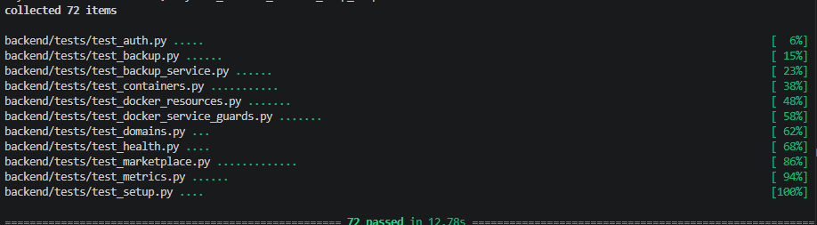

Uruchomienie testów frontendu w konsoli zwraca pełny sukces (3 pliki testowe, 9 testów zaliczonych):

```bash
$ npm run test

> frontend@0.0.0 test
> vitest run

✓ src/pages/CreateAccount.test.tsx (2 tests)
✓ src/pages/Security.test.tsx (2 tests)
✓ src/test/App.test.tsx (5 tests)

Test Files  3 passed (3)
Tests       9 passed (9)
```

Zrzut ekranu z uruchomienia testów frontendu:

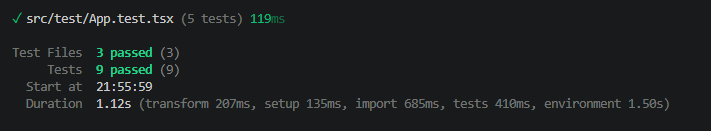

---

# Dokumentacja techniczna

## 19) Diagram komponentów i wdrożenia
System może być wdrażany lokalnie lub w chmurze Microsoft Azure za pomocą przygotowanych skryptów Terraform.

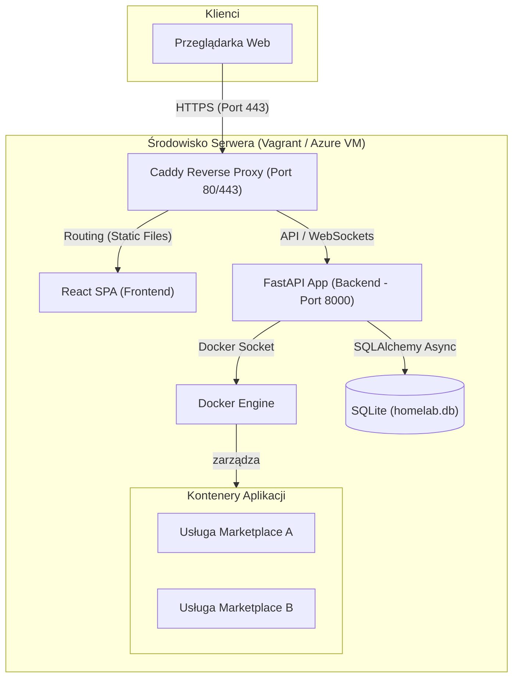

---

## 20) Instalacja i konfiguracja (CI oraz aktualizacja obrazów)

### Instrukcja instalacji (Lokalnie):
1. Skonfiguruj plik środowiskowy backendu:
   ```bash
   cd backend
   cp .env.example .env
   ```
2. Zainstaluj zależności Pythona i uruchom serwer FastAPI:
   ```bash
   python -m venv venv
   source venv/bin/activate
   pip install -r requirements.txt -r requirements-dev.txt
   alembic upgrade head
   uvicorn app.main:app --reload
   ```
3. Uruchom deweloperski frontend React:
   ```bash
   cd ../frontend
   npm ci
   npm run dev
   ```

### Wdrożenie produkcyjne (Docker Compose + Azure):
Dla wdrożenia w chmurze Azure przygotowano skrypty Terraform w katalogu `infra/azure/`. Plik [main.tf](../infra/azure/main.tf) tworzy maszynę wirtualną, a konfiguracja `cloud-init.yaml.tftpl` instaluje Dockera i uruchamia aplikację za pomocą pliku `docker-compose.prod.yml`.

### CI i publikacja obrazów Docker (GitHub Actions + Watchtower):
W katalogu `.github/workflows/` zaimplementowano proces ciągłej integracji ([ci.yml](../.github/workflows/ci.yml)), który przy każdym wypchnięciu zmian (push) do gałęzi `main` lub `develop` automatycznie:
1. Uruchamia lintery (`ruff` dla backendu oraz `eslint` dla frontendu).
2. Sprawdza typowanie statyczne (`mypy` oraz `tsc`).
3. Wykonuje automatyczne testy jednostkowe (`pytest` i `vitest`).
4. Buduje produkcyjne obrazy Docker i wysyła je do rejestru `ghcr.io`.

Workflow GitHub Actions nie wykonuje bezpośredniego deploymentu na serwer produkcyjny. Aktualizacja działającej instancji jest realizowana na prywatnym serwerze przez skonfigurowany mechanizm Watchtower, który cyklicznie sprawdza rejestr obrazów, pobiera nowsze wersje obrazów zbudowanych przez CI i restartuje odpowiednie kontenery.

---

## 21) Implementacja zaplanowanych mechanizmów zapewniających bezpieczeństwo w praktyce
Zabezpieczenia z punktu 13 zostały odzwierciedlone w kodzie źródłowym aplikacji w następujący sposób:
* **Zabezpieczenie Sesji Użytkownika:** W pliku [auth.py](../backend/app/routers/auth.py) routerów uwierzytelniania wdrożono asynchroniczne sprawdzanie haseł przy użyciu biblioteki `bcrypt` oraz asynchroniczne odpytywanie bazy o sekret 2FA. Endpointy `/me`, `/2fa/setup` oraz `/2fa/verify` są chronione za pomocą zależności `require_current_user`.
* **Granice autoryzacji backendu:** W projekcie istnieje zależność `require_admin_user`, lecz nie jest jeszcze zastosowana na endpointach administracyjnych takich jak `/api/containers`, `/api/backup`, `/api/marketplace` czy `/api/domains`. Oznacza to, że pełna autoryzacja ról na poziomie API wymaga dalszej implementacji.
* **Zabezpieczenie operacji Docker:** Serwis [docker_service.py](../backend/app/services/docker_service.py) ogranicza operacje do wywołań Docker SDK i komend `docker compose` budowanych jako lista argumentów, co zmniejsza ryzyko wstrzykiwania poleceń powłoki. Dostęp do demona Docker pozostaje jednak wysokouprawnionym elementem systemu i powinien być chroniony przez izolację hosta, Caddy, LAN/VPN oraz właściwe uprawnienia do `/var/run/docker.sock`.
* **Izolacja sieciowa i Proxy:** Zgodnie z założeniami wdrożenia, ochrona pozostałych funkcjonalnych tras API (zarządzanie kontenerami, backupy, marketplace i domeny) jest w obecnej wersji realizowana głównie przez serwer proxy Caddy oraz ograniczenie dostępu sieciowego do panelu.

---

# Dokumentacja użytkownika

## 22) Podręcznik użytkownika

### Spis treści

| Nr | Temat | Autor |
|:---|:------|:------|
| 1 | Wstęp | Michał Haładus |
| 2 | Pierwsze uruchomienie — Kreator konfiguracji (Setup Wizard) | Michał Haładus |
| 3 | Logowanie i uwierzytelnianie dwuetapowe (2FA) | Michał Haładus |
| 4 | Moduł Dashboard — Monitorowanie zasobów serwera | Michał Haładus |
| 5 | Moduł Zarządzania Kontenerami Docker | Michał Haładus |
| 6 | Marketplace — Instalacja nowych aplikacji | Michał Haładus |
| 7 | Kopie zapasowe (Backup) — Tworzenie i przywracanie | Michał Haładus |
| 8 | Konfiguracja domen i certyfikatów SSL | Michał Haładus |
| 9 | Logi audytowe — Przegląd historii operacji | Michał Haładus |
| 10 | Ustawienia konta i zarządzanie użytkownikami | Michał Haładus |

---

### 1. Wstęp

Server Manager to nowoczesny panel graficzny umożliwiający szybką administrację domowym serwerem (homelab). System został zaprojektowany tak, aby wyeliminować konieczność ręcznego korzystania z terminala SSH przy codziennych zadaniach, takich jak uruchamianie usług, monitorowanie zasobów czy tworzenie kopii zapasowych.

Dostęp do panelu uzyskuje się za pośrednictwem przeglądarki internetowej pod adresem skonfigurowanym podczas pierwszego uruchomienia w kreatorze `Setup Wizard` (np. `https://<twoja-domena>/dashboard`) lub pod lokalnym adresem IP/hostem ustawionym w plikach `.env`. Wymagane jest posiadanie konta użytkownika — przy pierwszym uruchomieniu systemu wyświetlany jest kreator rejestracji konta administratora.

> **Uwaga językowa:** Nazwy przycisków i sekcji w podręczniku podano zgodnie z aktualnym interfejsem aplikacji, który w wielu miejscach używa etykiet angielskich, np. `Restore From File`, `Create Full Backup` lub `Setup Wizard`. Opisy kroków pozostają po polsku.

**Wymagania po stronie klienta:**
* Przeglądarka internetowa: Chrome 90+, Firefox 88+, Edge 90+ lub Safari 14+
* Połączenie sieciowe z serwerem (LAN lub Internet)
* Aplikacja uwierzytelniająca (np. Google Authenticator, Aegis) — wymagana przy włączonej weryfikacji 2FA

---

### 2. Pierwsze uruchomienie — Kreator konfiguracji (Setup Wizard)

Przy pierwszym uruchomieniu systemu (gdy baza danych nie zawiera żadnych kont użytkowników), aplikacja automatycznie przekierowuje na stronę konfiguracyjną **Setup Wizard**.

**Kroki konfiguracji początkowej:**
1. Otwórz przeglądarkę i przejdź pod adres serwera (np. `http://192.168.1.100:8000`).
2. System wykryje brak kont i wyświetli formularz rejestracji administratora.
3. Wypełnij pola:
   * **Nazwa użytkownika** — unikalna nazwa loginu (np. `admin`).
   * **Hasło** — silne hasło (zalecane minimum 12 znaków, mieszanka liter, cyfr i znaków specjalnych).
   * **Powtórz hasło** — potwierdzenie hasła.
4. Kliknij przycisk **Create Admin Account**.
5. System utworzy konto z rolą `admin`, zaszyfruje hasło algorytmem `bcrypt` i przekieruje na stronę logowania.

> **Wskazówka:** Po utworzeniu konta zaleca się natychmiastowe włączenie uwierzytelniania dwuetapowego (2FA) w ustawieniach konta, aby zwiększyć bezpieczeństwo panelu.

---

### 3. Logowanie i uwierzytelnianie dwuetapowe (2FA)

**Standardowe logowanie:**
1. Na stronie logowania wprowadź **nazwę użytkownika** i **hasło**.
2. Kliknij przycisk **Sign in**.
3. Jeśli dane są poprawne, system wystawia token JWT i przekierowuje na Dashboard.

**Logowanie z włączonym 2FA:**
1. Po poprawnej weryfikacji loginu i hasła system wyświetla dodatkowy formularz z polem na **6-cyfrowy kod TOTP**.
2. Otwórz aplikację uwierzytelniającą (np. Google Authenticator) na telefonie.
3. Przepisz wyświetlony kod jednorazowy (ważny 30 sekund).
4. Kliknij **Verify 2FA**.
5. Po pozytywnej weryfikacji nastąpi przekierowanie na Dashboard.

**Możliwe komunikaty błędów:**
* *„Nieprawidłowa nazwa użytkownika lub hasło"* — błędne dane logowania.
* *„Nieprawidłowy kod weryfikacyjny"* — kod TOTP wygasł lub został źle przepisany.

---

### 4. Moduł Dashboard — Monitorowanie zasobów serwera

Dashboard to pierwszy ekran widoczny po zalogowaniu. Prezentuje w czasie rzeczywistym kluczowe informacje o stanie serwera w formie czytelnych kart i wykresów.

**Elementy widoku Dashboard:**

#### a) Karty podsumowania (górny pasek)
Na górze ekranu wyświetlane są cztery karty z najważniejszymi wskaźnikami:
* **CPU** — aktualne obciążenie procesora (wartość procentowa, kolor zmienia się na czerwony powyżej 80%).
* **RAM** — zużycie pamięci operacyjnej w procentach i megabajtach (np. „67% · 5.4 GB / 8 GB").
* **Dysk** — zajętość głównej partycji dyskowej.
* **Kontenery** — liczba aktywnych kontenerów Docker vs łączna liczba (np. „12 / 15 uruchomionych").

#### b) Wykresy historyczne (sekcja środkowa)
Poniżej kart wyświetlane są interaktywne wykresy liniowe (biblioteka Recharts), prezentujące trendy obciążenia serwera z ostatnich 24 godzin:
* **Wykres CPU** — procentowe zużycie procesora w czasie.
* **Wykres RAM** — procentowe zużycie pamięci operacyjnej w czasie.
* Oś X: znaczniki czasu (np. „14:00", „15:00").
* Oś Y: wartości procentowe (0–100%).
* Najechanie kursorem na punkt na wykresie wyświetla dymek (tooltip) z dokładną wartością i datą pomiaru.

#### c) Podsumowanie systemu (dolna sekcja)
* **System operacyjny** hosta (np. „Ubuntu 24.04 LTS").
* **Uptime** — czas nieprzerwanej pracy serwera od ostatniego restartu.
* **Transfer sieciowy** — łączna ilość danych wysłanych i odebranych (od uruchomienia systemu).

---

### 5. Moduł Zarządzania Kontenerami Docker

Moduł ten umożliwia pełną interakcję z kontenerami uruchomionymi na serwerze hosta bez konieczności korzystania z terminala SSH.

#### a) Lista kontenerów
Widok główny modułu wyświetla tabelę ze wszystkimi kontenerami Docker na serwerze:

| Kolumna | Opis |
|:--------|:-----|
| **Nazwa** | Nazwa kontenera Docker (np. `plex`, `adguard-home`) |
| **Obraz** | Nazwa i tag obrazu Docker (np. `plexinc/pms-docker:latest`) |
| **Status** | Aktualny stan: `Running` (zielona etykieta), `Stopped` (szara), `Paused` (żółta) |
| **Porty** | Mapowania portów hosta na porty kontenera (np. `8080:80/tcp`) |
| **Utworzono** | Data i godzina utworzenia kontenera |
| **Akcje** | Przyciski operacji na kontenerze |

#### b) Akcje cyklu życia kontenera
Administrator może użyć przycisków akcji po prawej stronie każdego rekordu:
* **Start** — uruchamia zatrzymany kontener. Przycisk dostępny tylko gdy kontener ma status `Stopped`.
* **Stop** — wysyła sygnał SIGTERM do procesu głównego kontenera, po upływie 10 sekund wymusza SIGKILL. Przycisk dostępny tylko gdy kontener ma status `Running`.
* **Restart** — wykonuje bezpieczny restart kontenera (stop → start).
* **Exec Terminal** — otwiera czarne okno terminala w przeglądarce (xterm.js), automatycznie łącząc użytkownika z sesją `/bin/sh` wewnątrz kontenera. Pozwala to na bezpośrednie wykonywanie poleceń diagnostycznych, takich jak `ls`, `cat`, `top` itp.
* **Delete** — trwale usuwa kontener z serwera. System wyświetla okno dialogowe z potwierdzeniem i opcjonalnym usunięciem powiązanych wolumenów danych.

#### c) Edycja konfiguracji
Po kliknięciu nazwy kontenera otwiera się widok szczegółów, który zawiera:
* **Edytor Docker Compose** — wbudowany edytor kodu (CodeMirror) umożliwiający modyfikację pliku `docker-compose.yml` bezpośrednio w przeglądarce.
* **Zmienne środowiskowe** — lista zmiennych `.env` z możliwością edycji wartości.
* Po zapisaniu zmian system automatycznie przebudowuje kontener poleceniem `docker compose up -d`.

> **Uwaga:** W aktualnym interfejsie główny panel jest dostępny po zalogowaniu, a typowy użytkownik systemu działa jako administrator. Rola `viewer` jest przewidziana w modelu danych, ale ograniczenia odczytowe i blokada akcji administracyjnych wymagają dalszej implementacji.

---

### 6. Marketplace — Instalacja nowych aplikacji

Marketplace to wbudowany katalog popularnych aplikacji self-hosted, gotowych do wdrożenia na serwerze jednym kliknięciem.

**Dostępne aplikacje (przykładowe):**

| Aplikacja | Opis | Domyślny port |
|:----------|:-----|:--------------|
| AdGuard Home | Blokada reklam i śledzenia na poziomie DNS | 3000 |
| Plex Media Server | Serwer multimediów (filmy, muzyka, zdjęcia) | 32400 |
| Home Assistant | Automatyka inteligentnego domu | 8123 |
| Nextcloud | Prywatna chmura (pliki, kalendarz, kontakty) | 8080 |
| Vaultwarden | Menedżer haseł (kompatybilny z Bitwarden) | 8222 |
| Uptime Kuma | Monitoring dostępności usług | 3001 |

**Proces instalacji krok po kroku:**
1. Przejdź do zakładki **Marketplace** w menu bocznym.
2. Przeglądaj dostępne aplikacje wyświetlone w formie kart z ikoną, opisem i domyślnym portem.
3. Kliknij przycisk **Deploy** przy wybranej aplikacji.
4. W wyświetlonym formularzu możesz opcjonalnie zmienić:
   * **Nazwę aplikacji** — przyjazna nazwa wyświetlana w panelu.
   * **Port hosta** — numer portu, na którym usługa będzie dostępna (system automatycznie sprawdza, czy port nie jest zajęty).
5. Kliknij **Confirm Deploy**.
6. System wykonuje w tle następujące operacje:
   * Tworzy katalog aplikacji na dysku hosta.
   * Zapisuje szablon `docker-compose.yml` i plik `.env`.
   * Uruchamia `docker compose up -d` (pobieranie obrazu + start kontenera).
7. Po pomyślnym wdrożeniu karta aplikacji zmienia status na **„Deployed"** (zielony wskaźnik). W przypadku błędu wyświetlany jest status **„Failed"** z komunikatem diagnostycznym.

> **Ważne:** Jeśli wybrany port jest już zajęty przez inną usługę, system zablokuje instalację i wyświetli powiadomienie o konflikcie portów.

---

### 7. Kopie zapasowe (Backup) — Tworzenie i przywracanie

Moduł kopii zapasowych pozwala zabezpieczyć dane serwera przed utratą. Obejmuje bazę danych SQLite oraz pliki konfiguracyjne aplikacji.

**Tworzenie kopii zapasowej:**
1. Przejdź do zakładki **Backup** w menu bocznym.
2. Kliknij **Create Config Backup** albo **Create Full Backup** w górnej części widoku.
3. System spakuje do archiwum `tar.gz` następujące elementy:
   * Plik bazy danych `homelab.db`.
   * Pliki konfiguracyjne aplikacji z Marketplace (`docker-compose.yml`, `.env`).
4. Po zakończeniu nowa kopia pojawi się na liście z datą utworzenia i rozmiarem pliku.

**Przywracanie kopii zapasowej:**
1. Przygotuj wcześniej wyeksportowane archiwum `.tar.gz` z kopią zapasową.
2. W sekcji **Restore From File** wybierz plik z dysku lokalnego.
3. Kliknij **Restore Backup**.
4. System wyświetli okno potwierdzenia z ostrzeżeniem, że aktualne dane zostaną nadpisane.
5. Po potwierdzeniu backend przywraca bazę danych i pliki konfiguracyjne z przesłanego archiwum. Jeśli archiwum zawiera pełną kopię z wolumenami, przywracane są również dane wolumenów Dockera.

**Pobieranie i usuwanie:**
* **Create Config Backup / Create Full Backup** — generuje archiwum na serwerze i automatycznie pobiera je w przeglądarce.
* **Available Backups** — pokazuje kopie zapisane w katalogu backupów po stronie serwera.
* **Delete** — trwale usuwa wybraną kopię zapasową z serwera.

---

### 8. Konfiguracja domen i certyfikatów SSL

Panel domen służy do podglądu konfiguracji bazowej domeny ustawionej w kreatorze pierwszego uruchomienia oraz do synchronizacji tras Caddy dla dashboardu i aplikacji z Marketplace. Certyfikaty HTTPS obsługuje Caddy Server, zależnie od ustawień `SITE_ADDRESS`, `DOMAIN`, `ACME_EMAIL` i trybu HTTPS.

**Obsługa domen w aktualnej wersji:**
1. Skonfiguruj bazową domenę w **Setup Wizard** podczas pierwszego uruchomienia.
2. Przejdź do zakładki **Domains**.
3. Sprawdź status bazowej domeny, tryb HTTPS, adres e-mail ACME i listę zarządzanych tras.
4. Włącz **Live Checks**, jeśli chcesz wykonać bieżące sprawdzenie DNS i certyfikatów.
5. Kliknij **Sync Caddy Routes**, aby ponownie wygenerować trasy dla aplikacji z Marketplace.

Aktualny interfejs nie posiada formularza ręcznego dodawania dowolnej pary „domena → port". Trasy marketplace są tworzone według wzorca `nazwa-aplikacji.domena-bazowa`.

---

### 9. Logi audytowe — Przegląd historii operacji

Model danych zawiera tabelę `audit_log`, która została przewidziana do rejestrowania historii operacji administracyjnych wykonanych w systemie.

* Struktura wpisu obejmuje: datę, identyfikator użytkownika, typ akcji (np. `container.stop`), cel operacji, adres IP oraz status powodzenia.
* W obecnej wersji projektu nie ma jeszcze widoku przeglądania logów audytowych ani automatycznego zapisu wpisów dla wszystkich operacji administracyjnych.
* Tabela `audit_log` stanowi przygotowaną bazę pod dalsze rozszerzenie bezpieczeństwa i rozliczalności działań.

---

### 10. Ustawienia konta i zarządzanie użytkownikami

Administrator może w ustawieniach:
* Włączyć uwierzytelnianie dwuetapowe (2FA) — system wyświetli kod QR do zeskanowania aplikacją uwierzytelniającą.
* Zweryfikować kod TOTP dla już skonfigurowanego konta.

Aktualna wersja nie posiada jeszcze gotowego przepływu wyłączania 2FA, zmiany hasła ani zarządzania dodatkowymi kontami użytkowników z poziomu interfejsu.
